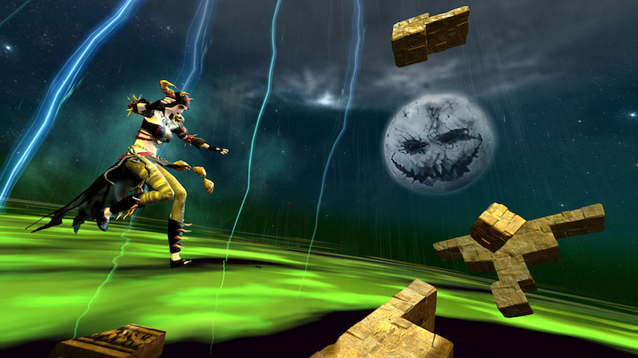

I missed out on Halloween in Tyria the first time around because I was away on holiday, so welcomed its return with some anticipation. <a href="https://www.guildwars2.com/en/the-game/releases/october-15-2013/" title="Blood and Madness patch notes">Patch day rolled around</a> and I made my way to deepest, darkest Ascalon to dig around the Reliquary and make fun of Prince Thorn, collecting my handy–dandy Relay Golem on the way out. I enjoyed the ‘straight to the point’ exposition and thought that the characters of Thorn and Magister Tassi were decent enough.

<figure class="pull">
    
    <figcaption><q>Oh my gosh… that moon is going to haunt my dreams</q>—my 9 year old nephew</figcaption>
</figure>

Next, I ran around Queensdale opening doors until I could enter the Mad King’s realm. I made a beeline for the Mad King’s tower, having heard great things about the challenge that it offered. 45 <a href="http://www.youtube.com/watch?v=wa3eoMnMC80" title="Expert swearing demonstration">sweary</a> minutes later, I was in total agreement. I’m no jumping puzzle aficionado—there are a good few that I haven’t completed yet—but the fast pace and learnability makes this one just about perfect. I’ve been back a handful of times since to complete dailies and will be sad to see it gone.

By far the most rewarding part of this patch, for me and many others, has been the levelling train charging around and around the labyrinth. My engineer was boosted from 60 to 80 in no time, and I had a brilliant time doing it. There’s just about the right level of difficulty present to keep players on their toes: trying to get around solo means getting pulled all over the place and rooted, and each champion boss has a mechanic that, if ignored, will cause zergs to die quickly.

<figure class="push">
    
    <figcaption>Bloody Prince ‘<a href="http://www.youtube.com/watch?v=diKz9udywg4">I Was Made For Lovin’ You</a>’ Thorn</figcaption>
</figure>

After a few rounds of ghostly <a href="http://en.wikipedia.org/wiki/British_bulldogs_(game)">British Bulldogs</a> (fun, but would benefit from more achievements and/or better rewards), I made a short but sweet (*badum tsh*) return trip to the Reliquary to put Prince Thorn back in his box. It’s clearly setting us up for round two next year, which I’m looking forward to already.

All in all, I’ve found Blood and Madness to be a lot of fun and the first successful return of an annual event. It would have been nice if the story had reached a little further; perhaps the Relay Golem could’ve been put to better use, maybe providing players with a quick way to get into the Mad King’s realm after some kind of attunement quest.
